# Trabalho Final Progress OpenEdge - Hamburgueria XTudo

## 1. Sobre o Projeto

### Descriçao do Projeto
Este projeto tem como objetivo o desenvolvimento de um sistema de gestão para uma hamburgueria, utilizando a linguagem Progress 4GL (OpenEdge). O sistema visa facilitar e organizar o gerenciamento de cadastros essenciais ao negócio, como cidades, clientes, produtos, pedidos e itens dos pedidos.

A aplicação oferece uma interface simples e funcional, com foco na integridade dos dados e validação de informações. Todas as operações de cadastro, alteração e exclusão seguem regras de negócio bem definidas para evitar inconsistências no banco de dados.


## Explicação de como o sistema funciona

O Projeto é composto por 5 Telas.
  - MENU 
  - CIDADES
  - CLIENTES
  - PRODUTOS
  - PEDIDOS

**1. Tela de Menu** <br>
A Tela de Menu é a interface inicial do sistema.
Principais funcionalidades:

- Navegar entre os módulos Cidades, Clientes, Produtos e Pedidos.
- Acessar as rotinas de geração de relatórios de Clientes e Pedidos.

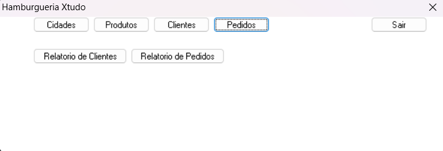

**2. Tela de Cidades** <br>
A Tela de Cidades é utilizada para o gerenciamento das informações de localidades.
Principais funcionalidades:

- Cadastro, edição e exclusão de registros de cidades.
- Associação de cidades aos cadastros de Clientes.

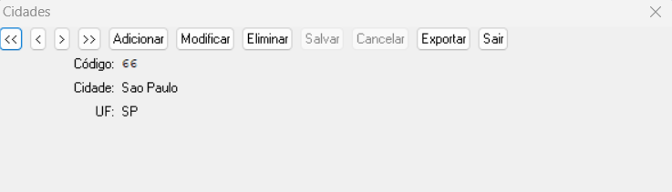

**3. Tela de Clientes** <br>
A Tela de Clientes centraliza as operações de cadastro e manutenção de clientes.
Principais funcionalidades:

- Inserção, alteração e exclusão de clientes.
- Associação de endereços e cidades ao cliente.

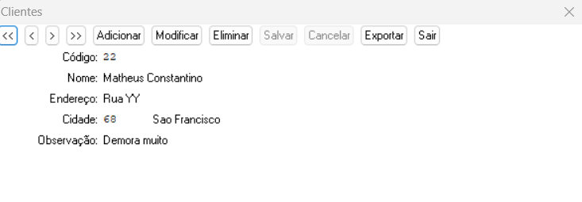

**4. Tela de Produtos** <br>
A Tela de Produtos é responsável pela gestão do catálogo de produtos.
Principais funcionalidades:

- Cadastro e atualização de informações de produtos.
- Definição de preços e códigos de identificação.

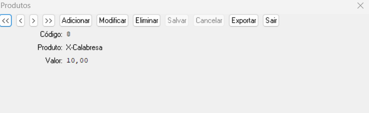

**5. Tela de Pedidos** <br>
A Tela de Pedidos permite o registro e gerenciamento de pedidos de clientes.
Principais funcionalidades:

- Inclusão de pedidos vinculados a clientes e produtos.
- Cálculo automático de valores totais.
- Consulta e impressão de pedidos registrados.

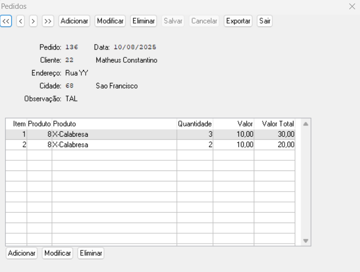

## 2. Execução e Estrutura

### 2.1 Pré-requisitos para Execução do Projeto
Para executar corretamente o projeto em sua máquina local, é necessário que os seguintes componentes estejam previamente instalados:<br>
- [JAVA Development Kit - JDK 20.0.2](https://jdk.java.net/archive/)
- [Progress OpenEdge (4GL)](https://www.progress.com/oedk)

Certifique-se de que ambas as ferramentas estejam devidamente configuradas nas variáveis de ambiente do sistema operacional.

### 2.2 Estrutura das Pastas e Arquivos
O projeto está organizado de forma modular, contendo as seguintes pastas e arquivos na raiz do diretório:<br>
`Menu.p` – Arquivo principal do sistema, responsável por inicializar a aplicação e fornecer acesso às demais funcionalidades por meio do menu principal.<br>
`modules/` – Diretório que contém os arquivos-fonte (`.p`) correspondentes às demais telas e módulos do sistema. Cada arquivo dentro dessa pasta implementa funcionalidades específicas.<br>
`includes/` – Diretório que armazena arquivos de inclusão (`.i`) contendo trechos de código reutilizáveis, como definições de variáveis globais, funções auxiliares.

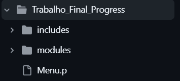

---

A pasta `modules` contém os arquivos-fonte responsáveis pela implementação das funcionalidades CRUD para as entidades do sistema. Especificamente, esta pasta inclui os seguintes arquivos:

`Cidades.p` – Implementa as funcionalidades CRUD referentes ao cadastro e manutenção de cidades.

`Clientes.p` – Implementa as funcionalidades CRUD referentes ao cadastro e manutenção de clientes.

`Produtos.p` – Implementa as funcionalidades CRUD referentes ao cadastro e manutenção de produtos.

`Pedidos.p` – Implementa as funcionalidades CRUD referentes ao cadastro e manutenção de produtos e itens.

Cada módulo encapsula as regras de negócio e interações específicas para sua entidade, garantindo a separação de responsabilidades e facilitando a manutenção e evolução do sistema.

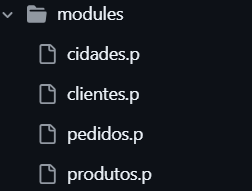

---
A pasta `includes` contém arquivos de inclusão que são reutilizados nos diversos módulos do sistema, com o objetivo de promover a modularidade e reduzir a duplicação de código.

`navbar.i` – Define a implementação dos botões da barra de navegação (navbar). Este arquivo é incluído nos programas sempre que a interface de navegação é necessária


---

A pasta `dados` contém todos os arquivos físicos que compõem o banco de dados do sistema, incluindo os arquivos de dados e índices utilizados pela base.

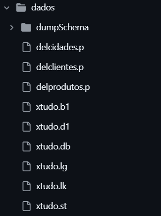

---

A pasta `DumpSchema` é composta por um arquivo de definição de esquema `.df` e uma subpasta `DumpDados`. O arquivo `.df` descreve a estrutura lógica do banco de dados, como tabelas, índices e relacionamentos.


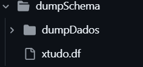

---
A subpasta `DumpDados` armazena os arquivos `.d`, que correspondem aos dumps dos dados armazenados no banco, representando o conteúdo das tabelas em formato físico ou exportado para restauração.

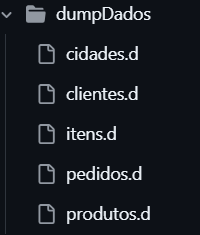

### 2.3 Instalando Projeto
**Instalando Projeto via `.Zip`:** <br>
Faça o download do projeto no GitHub utilizando a opção de download em formato `.zip`.


Extraia as pastas `Trabalho_Final_Progress` e `dados` diretamente na raiz do disco `C:\` do seu sistema operacional.


Crie um atalho para o executável do Progress OpenEdge (prowin.exe) na pasta `Trabalho_Final_Progress`, que será utilizado para executar o projeto.

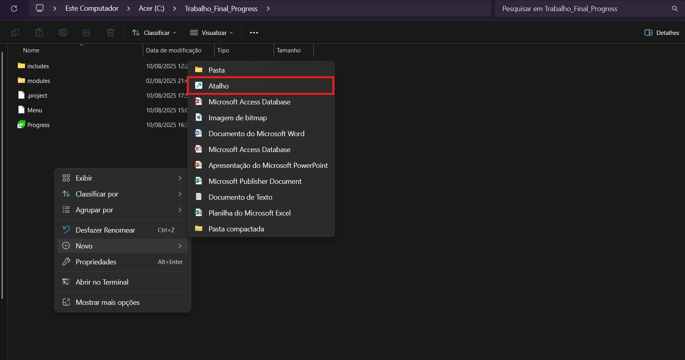

No campo de destino do atalho, insira o seguinte comando, que configura a execução do ambiente Progress com o projeto e conecta ao banco de dados:


```bash
C:\Progress\OpenEdge\bin\prowin.exe -p _desk.p -db c:/dados/xtudo.db -1 -d dmy -E
```

Obs: `-db c:/dados/xtudo.db -1` essa é a parte que vai nos conectar com o banco de dados.

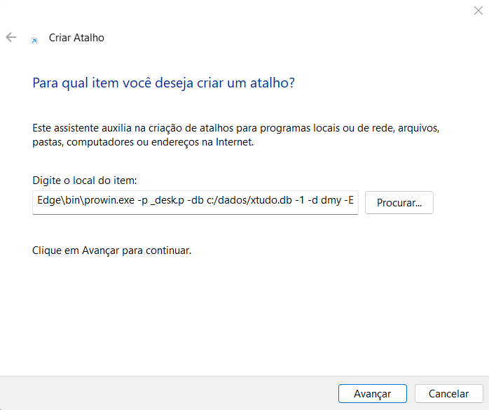

Após criar o atalho com a configuração acima, execute-o para iniciar o sistema conectado ao banco de dados.

### Como executar o projeto


conectar no banco de dados:


```
c:/dados/xtudo.db
```
