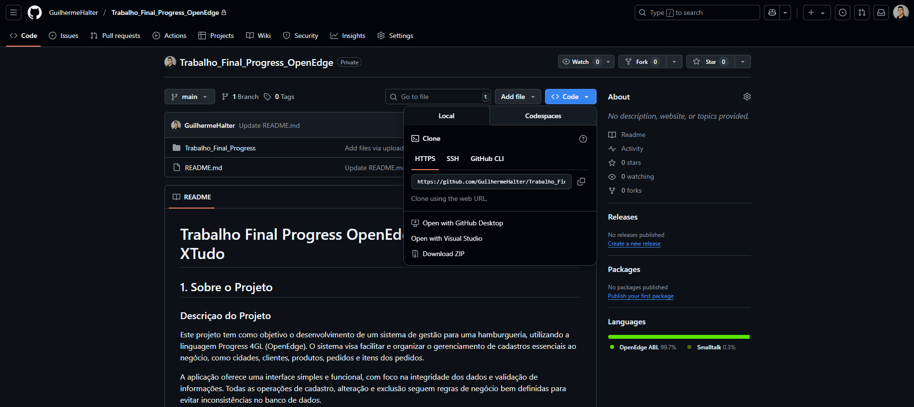
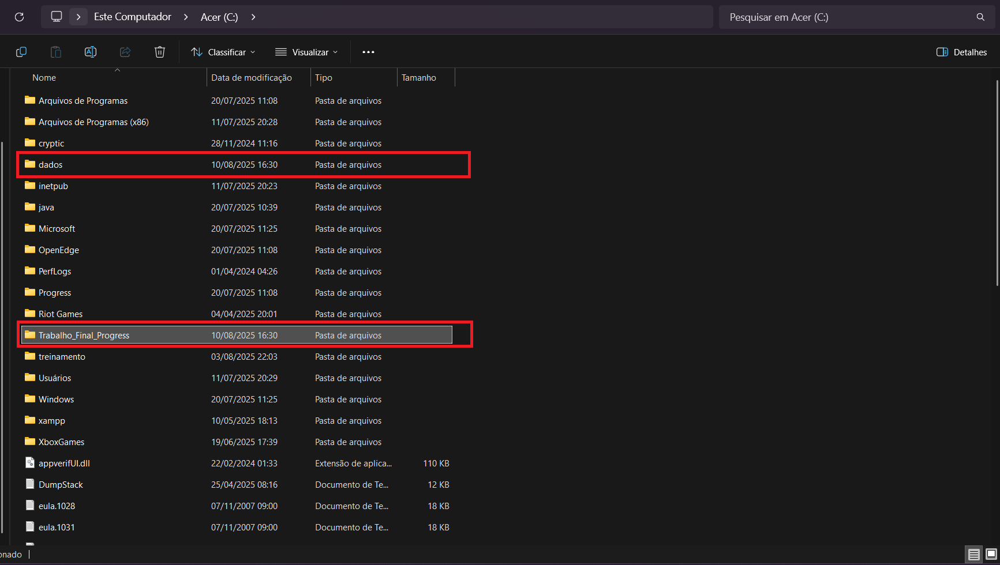

# Trabalho Final Progress OpenEdge - Hamburgueria XTudo

## 1. Sobre o Projeto

### Descriçao do Projeto
Este projeto tem como objetivo o desenvolvimento de um sistema de gestão para uma hamburgueria, utilizando a linguagem Progress 4GL (OpenEdge). O sistema visa facilitar e organizar o gerenciamento de cadastros essenciais ao negócio, como cidades, clientes, produtos, pedidos e itens dos pedidos.

A aplicação oferece uma interface simples e funcional, com foco na integridade dos dados e validação de informações. Todas as operações de cadastro, alteração e exclusão seguem regras de negócio bem definidas para evitar inconsistências no banco de dados.


## Explicação de como o sistema funciona

O Projeto é composto por 5 Telas.
  - MENU 
  - CIDADES
  - CLIENTES
  - PRODUTOS
  - PEDIDOS

**Tela de Menu:**
A Primeira tela do sistema e a tela de `Menu` ela serve para que o usuario possa navegar entre as outras telas do sistema e gerar os relatórios de `Clientes` e `Pedidos`.


## 2. Execução e Estrutura
[2.1 Pré-requisitos para Execução do Projeto](###2.1-Pré-requisitos-para-Execução-do-Projeto)
### 2.1 Pré-requisitos para Execução do Projeto
Para executar corretamente o projeto em sua máquina local, é necessário que os seguintes componentes estejam previamente instalados:<br>
- [JAVA Development Kit - JDK 20.0.2](https://jdk.java.net/archive/)
- [Progress OpenEdge (4GL)](https://www.progress.com/oedk)

Certifique-se de que ambas as ferramentas estejam devidamente configuradas nas variáveis de ambiente do sistema operacional.

### 2.2 Instalando Projeto
**Instalando Projeto via `.Zip`:**<br>
Acesse o repositório no GitHub e faça o download do projeto compactado em `.zip`.


Estraia tudo no `disco-local (c:)` do seu PC




### Como executar o projeto


conectar no banco de dados:


```
c:/Trabalho_Final_Progress/db/xtudo
```
